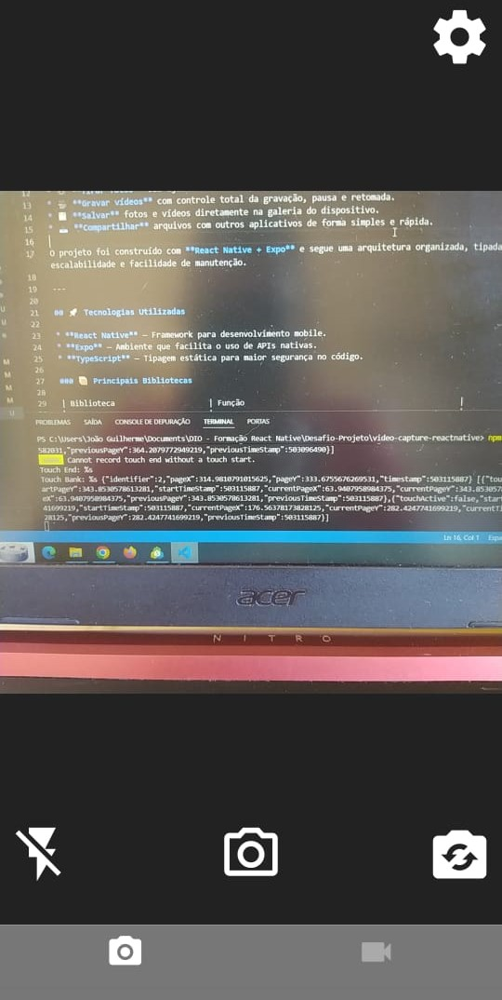
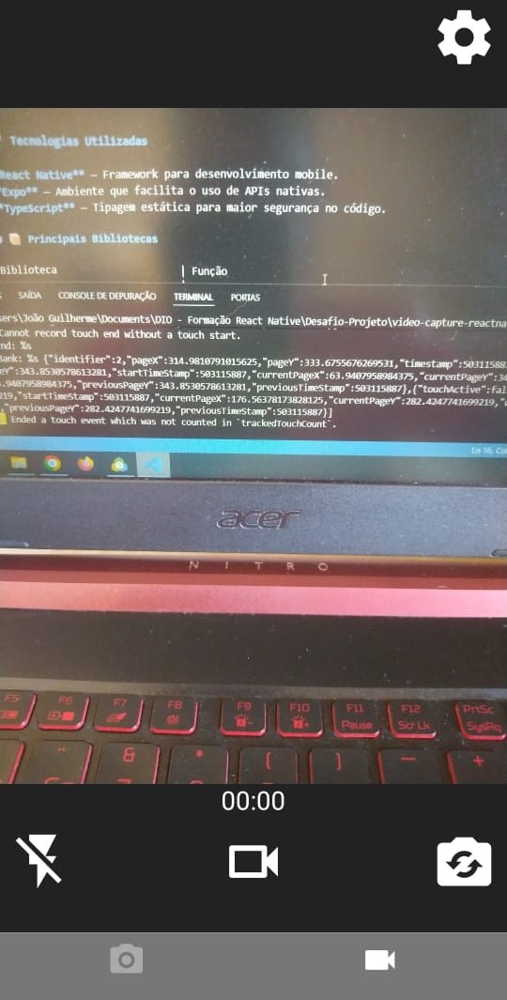

# 📸 Video Capture App

Aplicativo desenvolvido com **React Native**, **Expo** e **TypeScript**, que permite **tirar fotos e gravar vídeos diretamente do celular**, além de **salvar e compartilhar os arquivos** de forma prática e intuitiva.

---

## 💻 Sobre o Projeto

O **Expo Camera App** é um aplicativo mobile que explora os recursos nativos da câmera do dispositivo.
Com ele, é possível:

* 📷 **Tirar fotos** com ajustes de câmera, flash, proporção e qualidade.
* 🎥 **Gravar vídeos** com controle total da gravação, pausa e retomada.
* 💾 **Salvar** fotos e vídeos diretamente na galeria do dispositivo.
* 📤 **Compartilhar** arquivos com outros aplicativos de forma simples e rápida.

O projeto foi construído com **React Native + Expo** e segue uma arquitetura organizada, tipada com **TypeScript**, garantindo escalabilidade e facilidade de manutenção.

---

## 🚀 Tecnologias Utilizadas

* **React Native** — Framework para desenvolvimento mobile.
* **Expo** — Ambiente que facilita o uso de APIs nativas.
* **TypeScript** — Tipagem estática para maior segurança no código.

### 📦 Principais Bibliotecas

| Biblioteca                     | Função                                               |
| ------------------------------ | ---------------------------------------------------- |
| `expo/vector-icons`            | Ícones para a interface.                             |
| `react-navigation/native`      | Navegação entre telas.                               |
| `react-navigation/bottom-tabs` | Abas inferiores para alternar entre Foto e Vídeo.    |
| `react-native-screens`         | Otimização da navegação.                             |
| `expo-camera`                  | Controle da câmera para tirar fotos e gravar vídeos. |
| `expo-media-library`           | Salvamento de arquivos no dispositivo.               |
| `expo-sharing`                 | Compartilhamento de arquivos.                        |

---

## 🧭 Estrutura do App

O aplicativo é composto por **duas telas principais**:

### 📷 Tela de Foto

Permite capturar fotos com configurações personalizadas:

* Alternar entre **câmera frontal** e **traseira**.
* Controlar o **flash** entre: `off`, `on`, `auto`.
* Ajustar o **aspect ratio**: `1:1`, `4:3`, `16:9`.
* Selecionar a **qualidade da imagem**: `2160p`, `1080p`, `720p`, `480p`.

Após capturar uma foto, o usuário é direcionado para a **tela de visualização**, onde pode:

* 🗑️ **Apagar a foto**
* 💾 **Salvar na galeria**
* 📤 **Compartilhar o arquivo**

---

### 🎥 Tela de Vídeo

Permite gravar vídeos com recursos avançados:

* Alternar entre **câmera frontal** e **traseira**.
* Controlar o **flash** entre: `off`, `on`.
* Ajustar o **aspect ratio**: `1:1`, `4:3`, `16:9`.
* Selecionar a **qualidade do vídeo**: `2160p`, `1080p`, `720p`, `480p`.

Durante a gravação:

* ⏸️ É possível **pausar** e **retomar** a gravação.
* ✂️ Também é possível **encerrar e aparar** o vídeo.

Após a gravação, o usuário pode:

* ▶️ **Assistir ao vídeo**
* 🗑️ **Apagar o vídeo**
* 💾 **Salvar no dispositivo**
* 📤 **Compartilhar com outros apps**

---

## ⚙️ Como Executar o Projeto

### Pré-requisitos

* **Node.js** instalado.
* **Expo CLI** configurado.
* **Dispositivo físico ou emulador com câmera funcional**.

### Passos

```bash
# Clone o repositório
git clone https://github.com/Dev-JoaoSouza/expo-camera-app.git

# Acesse a pasta do projeto
cd expo-camera-app

# Instale as dependências
npm install

# Execute o projeto
npm run start
```

Use o **Expo Go** no seu celular para escanear o QR Code e testar o aplicativo!

---

## 🧠 Aprendizados

Durante o desenvolvimento deste projeto, foram explorados:

* O uso da **API de câmera do Expo** para manipulação de fotos e vídeos.
* Integração com **Media Library e Sharing API** para gerenciamento de arquivos.
* Implementação de **navegação com abas** usando `react-navigation`.
* Aplicação de **boas práticas com TypeScript** no React Native.

---

## 📸 Demonstração




---

## 🤝 Contribuições

Sinta-se à vontade para contribuir com melhorias, abrir issues e sugerir novas funcionalidades.

---

## 📜 Licença

Este projeto está sob a licença **MIT**.
Veja o arquivo [LICENSE](LICENSE) para mais detalhes.

---

## 🌐 Contato

👤 **João Dev**
📎 [LinkedIn](https://www.linkedin.com/in/joaosouza-dev/)
💻 [GitHub](https://github.com/Dev-JoaoSouza)
